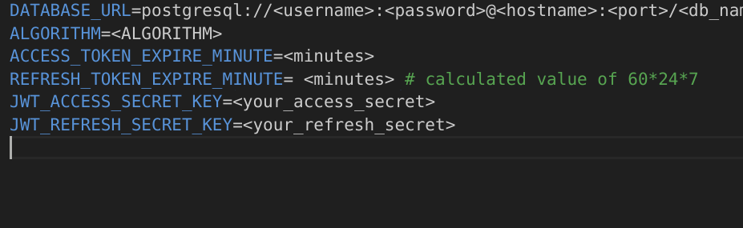

# Waste Management System

Waste Management System using FastAPI 

## Prerequisites

1. **Python** - Download [here](https://python.org)

2. **Pip** - Download [here](https://pip.pypa.io/en/stable/installation/)

3. **Pipenv**
   ```bash
   pip install pipenv

## Set up

* Clone the project repository
   ```bash
   git clone https://github.com/CK-EmbPro/Waste_management_fastapi.git

* Move the project directory and open cmd
   ```bash
   cd Waste_management_django

* Set up the db credentials - 

* Create that database you have defined

* Activate the virtual environment
   ```bash
   pipenv shell

* Install all dependencies in the virtual environment
   ```bash
   pipenv install


* Run the server
   ```bash
   uvicorn main:app --reload